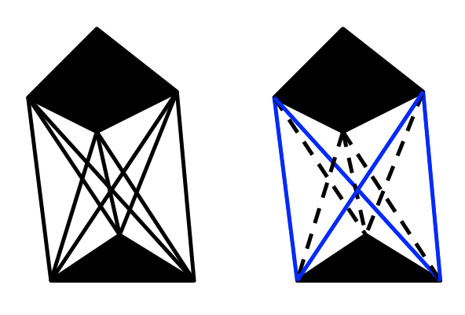
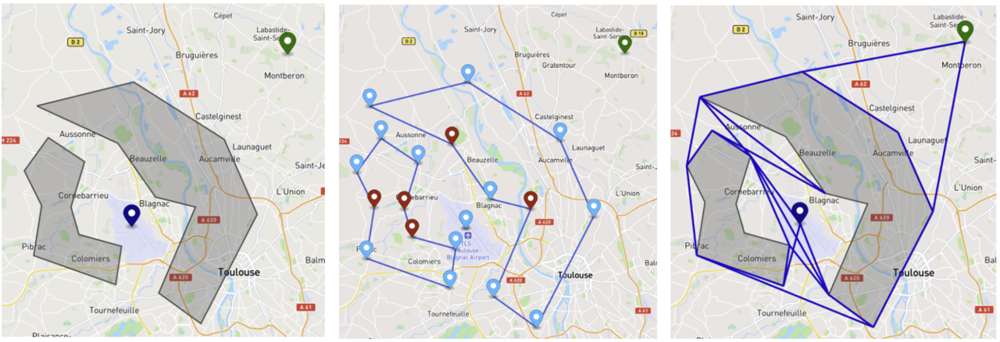

# GeoPathFinder

[](https://github.com/Razielwar/geopathfinder/actions/workflows/ci.yml)
[](https://badge.fury.io/js/geopathfinder)
[](https://opensource.org/licenses/MIT)

Geodesic-aware visibility graph implementation to support shortest path calculations on multi-destination targets with GeoJSON inputs.

This library provides a powerful and performant way to find the shortest path between a starting point and multiple target points, avoiding a set of polygonal obstacles. It is designed to work with geographic coordinates (latitude/longitude) and uses the Haversine formula for accurate distance calculations on a sphere.

## Key Differences

The key difference with what is existing currently about visibility graph implementation on the web is the performance as we do not build the whole visibility graph but build it step by step on the need when searching the best solution. It allows to avoid wasting time.

TO BE COMPLETED
benchmark results
link to other libraries

## Installation

```bash
yarn add geopathfinder
```

or

```bash
npm install geopathfinder
```

## Usage

### Basic Example

```typescript
import { VisibilityGraph } from 'geopathfinder';
import type { Feature, Point, Polygon } from 'geojson';

const start: Feature<Point> = {
  type: 'Feature',
  geometry: {
    type: 'Point',
    coordinates: [0, 0],
  },
  properties: {},
};

const targets: Feature<Point>[] = [
  {
    type: 'Feature',
    geometry: {
      type: 'Point',
      coordinates: [10, 10],
    },
    properties: {},
  },
];

const obstacles: Feature<Polygon>[] = [
  {
    type: 'Feature',
    geometry: {
      type: 'Polygon',
      coordinates: [
        [
          [5, 5],
          [6, 5],
          [6, 6],
          [5, 6],
          [5, 5],
        ],
      ],
    },
    properties: {},
  },
];

const graph = new VisibilityGraph(start, obstacles, targets);

// Search for the shortest path with a maximum distance of 2000 km
graph.searchAStar(2000).then(path => {
  console.log(path);
});
```

## API

The API documentation is available [here](./docs/index.html). (This will be generated later)

## Future Improvements

- Implementation of Lee's algorithm to detect valid paths using clockwise order for performance improvements.
- Support for holes in polygons.

## Algorith description

### Visibility Graph Generation

**Visibility graphs** are used to determine which points (nodes) are directly visible to each other — meaning a straight line between them does not intersect any obstacles (edges or polygons).

Algorithms for Visibility Determination
- **Naive Approach (O(n²))**:
For each point, check against all other points whether the connecting line intersects any existing edge.

- **Optimized Approach — Lee’s Algorithm (O(n log n))**:
More efficient than the naive approach. ***Not implemented yet***

#### Optimization Techniques
To reduce the complexity of the visibility graph:

- Ignore concave vertices of polygons — these are less likely to contribute to valid paths.

- Exclude lines directed into obstacles — such paths are infeasible.

- Lazy Evaluation of visibility links — generate connections only when required during the search.

Applying these optimizations can significantly reduce the number of visibility edges. For example, in the figure below, five links are removed by filtering out concave vertices and inward-pointing lines, leaving only the valid visibility edges (in blue).



Below is a visual representation of the environment after applying all visibility graph optimizations. Obstacles are shown in grey, the start position is marked in black, and the target position is marked in green. The blue lines represent the computed visibility graph, incorporating all previously described optimizations (e.g., excluding concave vertices and inward-facing lines).

As a result, the graph is significantly reduced in complexity, focusing only on meaningful visibility connections.



### Search Algorithm
To perform pathfinding within the graph, several algorithms can be used:

- **Dijkstra’s Algorithm**: A classic approach that guarantees the shortest path but may be inefficient in large graphs.

- **A (A-Star) Algorithm**: Currently implemented in this project. It improves efficiency by using a heuristic — specifically, the Haversine distance from the current node to the closest landing point — to guide the search.

**Distance max Constraint**

To prevent the algorithm from exploring the entire graph when no solution is possible, we introduce a maximum search distance (Dmax). The search will terminate early if all candidate paths exceed this threshold.

## References

- Visibility Graphs Overview: [Smith College – Visibility Graphs](https://www.science.smith.edu/~istreinu/Teaching/Courses/274/Spring98/Projects/Philip/fp/visibility.htm)

- Related Topics: 
   * [Reduced Visibility Graphs](https://www.cs.cmu.edu/~motionplanning/lecture/Chap5-RoadMap-Methods_howie.pdf)
   * [Lee’s Algorithm (O(n² log n))](https://dav.ee/papers/Visibility_Graph_Algorithm.pdf)
   * [Visibility graphs by Haarika Koneru](https://www.cs.kent.edu/~dragan/ST-Spring2016/visibility%20graphs.pdf)

## License

This project is licensed under the MIT License - see the [LICENSE](LICENSE) file for details.
